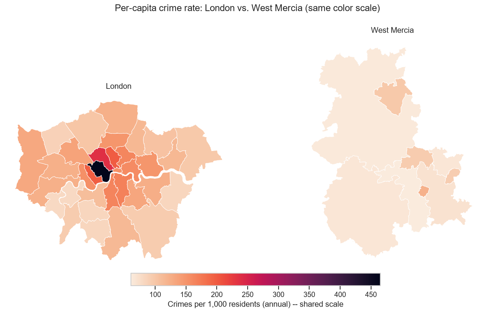
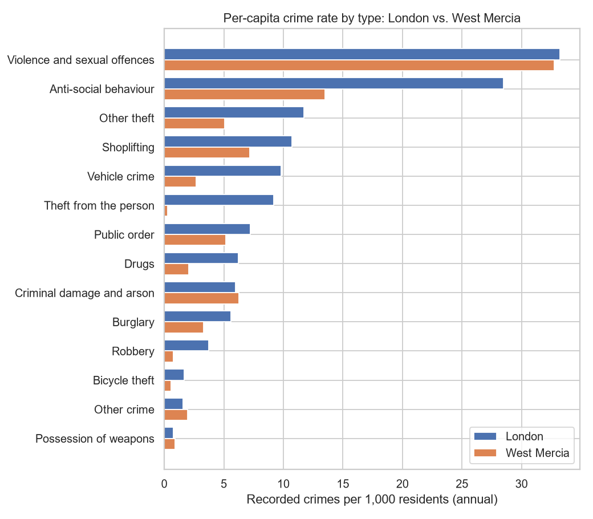

# 🚓 UK Crime Analysis: London vs West Mercia

**1.35 million street-level police records (May 2025 – May 2026), joined with population and deprivation data** to ask how crime varies between areas, and why.

`Python` · `pandas` · `GeoPandas` · `matplotlib` · `seaborn` · `Jupyter` · open government data



## Key findings

- **London's crime rate is ~65% higher overall, but violent crime is the same.** Violence and sexual offences run at 33.2 per 1,000 residents in London vs 32.8 in West Mercia. The gap comes from crowd-driven crime: theft from the person is ~35× higher in London, and robbery ~5×.
- **Raw counts mislead.** Westminster's rate of ~465 crimes per 1,000 residents reflects visitors, not residents. The City of London goes from the *lowest* borough by count to 8th-highest per resident.
- **Deprivation tracks crime** (r ≈ 0.57 in London once the two outliers are set aside, r ≈ 0.69 in West Mercia). I checked this against the income-only measure too, because the headline deprivation index partly includes crime data itself.



**→ Full write-up with all charts and caveats: [REPORT.md](REPORT.md)**

## What this project shows

- **Joining several public datasets**: police.uk street-level crime, ONS population, the deprivation index (IMD 2019), and ONS boundary files
- **Data cleaning with documented decisions**: anonymised records, crimes relocated outside the force area, missing locations, and council names that don't match between datasets
- **Per-capita normalisation, outlier reasoning, and correlation**, including a check that the result doesn't depend on one measure
- **Maps (choropleths)** with GeoPandas, including a shared colour scale so the two areas can be compared fairly
- **Reusable code** in `src/` (loading and cleaning functions) that both force areas use
- **Written communication**: a report with caveats, aimed at non-technical readers

---

## Question we're starting with

> How does crime vary across a police force's boroughs/districts, and how
> much of that variation tracks with deprivation and population?

## Data sources

Every source below is England-wide (not London-specific), so the same raw
files serve both analyses — only the filtered-to name set differs
(`clean.LONDON_BOROUGHS` vs. `clean.WEST_MERCIA_DISTRICTS`).

| Source | What it gives us | Link |
|--------|------------------|------|
| data.police.uk | Street-level crime by month + LSOA | https://data.police.uk/data/ |
| ONS population estimates (mid-2024) | Population per borough/district, for per-capita rates | https://www.ons.gov.uk/peoplepopulationandcommunity/populationandmigration/populationestimates/datasets/populationestimatesforukenglandandwalesscotlandandnorthernireland |
| MHCLG Index of Multiple Deprivation 2019 (File 10, local authority summaries) | Deprivation score per borough/district | https://www.gov.uk/government/statistics/english-indices-of-deprivation-2019 |
| ONS local authority district boundaries (via UK-GeoJSON mirror) | Borough/district shapes, for maps | https://github.com/martinjc/UK-GeoJSON |

**Data is not stored in git** (see `.gitignore`). To reproduce:

- **Crime data**: use the custom download at https://data.police.uk/data/ —
  select "Metropolitan Police Service" (or "West Mercia Police") and a date
  range, extract the monthly CSVs into `data/raw/london/<year-month>/` (or
  `data/raw/west-mercia/<year-month>/`).
- **Population data**: download the "mid-2024" xlsx from the ONS link above
  and save it as `data/raw/population/mye24tablesuk.xlsx`.
- **Deprivation data**: from the gov.uk link above, download "File 10:
  Local Authority District Summaries (lower-tier)" and save it as
  `data/raw/deprivation/File_10_LAD_summaries.xlsx`.
- **Boundary data**: download
  `json/administrative/eng/lad.json` from the GitHub repo above and save it
  as `data/raw/geography/england_lad.geojson`.

## Project structure

```
data/
  raw/               # original, immutable downloads — NEVER edit by hand
  processed/         # cleaned/derived data our code produces
notebooks/
  london/            # Metropolitan Police analysis (01-05)
  west-mercia/       # independent West Mercia analysis (01-05, same structure)
  comparison/        # 01_london_vs_westmercia.ipynb — direct comparison
src/                 # reusable Python (cleaning functions, helpers)
outputs/             # figures, maps, and exported tables
```

## Setup

```bash
# 1. Create a virtual environment
python -m venv .venv

# 2. Activate it
#    Windows (PowerShell):
.venv\Scripts\Activate.ps1
#    macOS/Linux:
#    source .venv/bin/activate

# 3. Install dependencies
pip install -r requirements.txt

# 4. Launch Jupyter
jupyter lab
```
