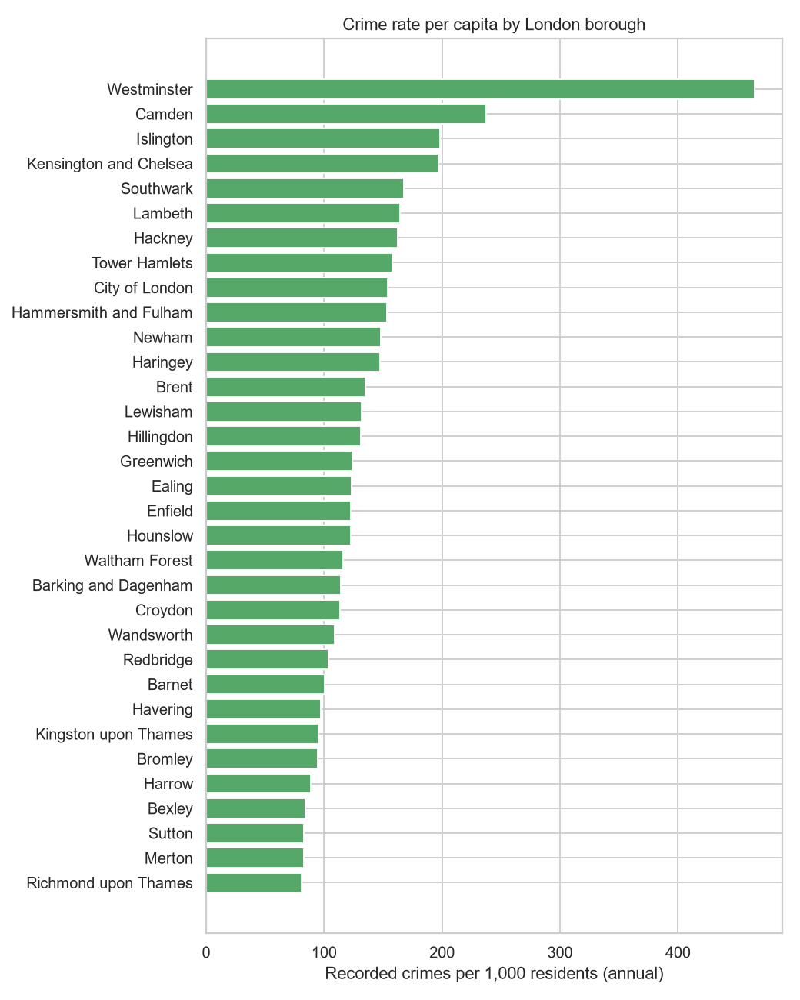
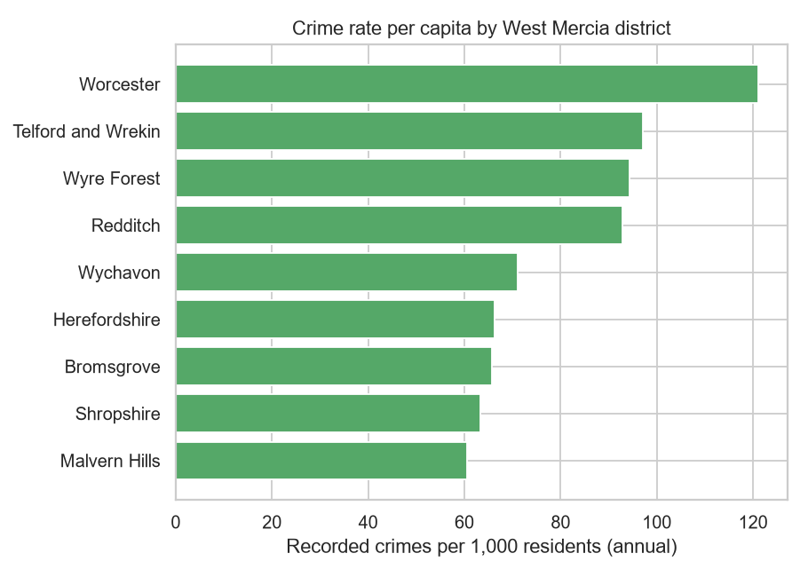
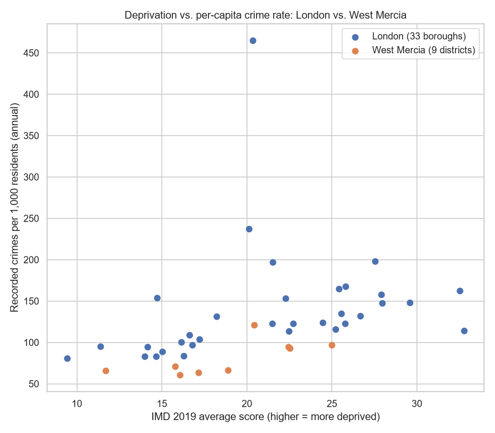

# UK Crime Data Analysis: London vs. West Mercia

**A summary of findings from `notebooks/london/`, `notebooks/west-mercia/`, and `notebooks/comparison/`.**

## The question

How does recorded crime vary across a police force's boroughs/districts,
and how much of that variation tracks with population and deprivation?

Two force areas were analysed — the **Metropolitan Police** (Greater
London, 33 boroughs) and **West Mercia Police** (Herefordshire, Shropshire,
Telford and Wrekin, and Worcestershire's districts, 9 in total) — each
independently, then compared directly.

## Data and method

| Source | What it provided |
|---|---|
| [data.police.uk](https://data.police.uk/data/) | Street-level recorded crime, May 2025 – May 2026 (13 months), by month and LSOA |
| ONS mid-2024 population estimates | Resident population per borough/district, for per-capita rates |
| MHCLG Index of Multiple Deprivation (IMD) 2019 | A deprivation score per borough/district (local-authority-level summary) |
| ONS local authority boundaries (via a GitHub mirror) | Shapes for choropleth maps |

Both force areas were run through the same five-stage pipeline: **explore
→ clean → aggregate by area → per-capita rate → deprivation → map** — with
every step re-verified against West Mercia's own data rather than assuming
London's conclusions would carry over.

**Caveats worth keeping in mind when reading the findings below:**
- IMD's composite score includes a "Crime" sub-domain (~9.3% weight) that
  is itself partly built from recorded police data, so its correlation
  with our own crime counts isn't fully independent. Every deprivation
  finding below was cross-checked against the IMD's Income domain alone
  (which contains no crime data), and the two always agreed closely.
- IMD 2019 predates the crime data (2025–2026) by several years;
  deprivation patterns shift slowly, but this isn't a perfect time match.
- These are correlations across a small number of areas (33 boroughs, 9
  districts) at one snapshot in time — consistent with real relationships,
  not proof of what causes what.
- A handful of real data quirks were found and handled deliberately rather
  than silently: police-anonymised Anti-social-behaviour rows with no
  Crime ID, a small share of sensitive-offence rows relocated to
  anonymised coordinates outside the force area, West Mercia rows with no
  location published at all, and a local-authority naming mismatch
  ("Herefordshire" vs. the official "Herefordshire, County of"). Each is
  documented where it was found, in the relevant notebook.

## London: population explains less than it looks like it should

Raw crime counts by borough are dominated by **Westminster** — nearly
double the next-highest borough. But once population is accounted for,
the picture sharpens further rather than softening:

- **Westminster's per-capita rate is ~465 crimes per 1,000 residents per
  year** — not plausible as "crime happening to residents"; it reflects an
  enormous non-resident footfall (tourism, retail, nightlife) that raw
  population figures don't capture.
- **City of London** (the financial district, ~15,000 residents) shows the
  mirror-image distortion: it looked like the *lowest*-crime borough by raw
  count, but jumps to **8th-highest per-capita**, because a small,
  genuine crime count is divided by a tiny resident population.
- Once those two are set aside, deprivation correlates moderately with
  crime rate (**r ≈ 0.57**, confirmed against the Income domain
  independently at r ≈ 0.58) — a real relationship, but far from the whole
  story, and only visible after removing the two footfall-distorted
  boroughs.

## West Mercia: a cleaner relationship, no extreme outlier

West Mercia is a much smaller dataset (110,499 rows vs. London's 1.24
million) and, notably, has **nothing on Westminster's scale**:

- **Worcester** — the county town, a compact city rather than a large rural
  district — has the highest per-capita rate (~121 per 1,000/yr), despite
  only middling deprivation. A smaller-scale echo of Westminster's pattern,
  plausibly for the same reason (a city centre serving more than just its
  own residents), but nowhere near as extreme.
- **Deprivation correlates strongly right away — r ≈ 0.69 (IMD) / 0.71
  (Income) — with no districts needing to be excluded.** This is a
  cleaner result than London's, most likely *because* West Mercia lacks a
  Westminster-scale outlier to distort it in the first place.

## Deprivation, side by side

West Mercia's districts (orange) cover a similar range of deprivation
scores to many London boroughs, but sit consistently *below* them on crime
rate — deprivation alone doesn't explain why London runs higher overall.

## The comparison's headline finding: London isn't uniformly "more dangerous"

London's overall per-capita crime rate is **136 per 1,000/yr, about 65%
higher than West Mercia's 82**. But breaking that gap down by crime type
tells a sharper story:

- **Violence and sexual offences — the single largest category in both
  forces — occurs at almost exactly the same per-capita rate: 33.2 in
  London vs. 32.8 in West Mercia (about a 1% difference).** Criminal
  damage and arson are effectively tied too.
- London's higher overall rate is concentrated almost entirely in
  **opportunistic, dense-crowd crime**: theft from the person is **~35x**
  higher in London, robbery ~5x, vehicle crime and drugs ~3x,
  anti-social behaviour ~2x.
- In other words: **London's serious violent-crime risk per resident is
  close to identical to a much smaller, more rural force area.** Its
  higher headline rate is mostly a story about pickpocketing, vehicle
  crime, and street drug activity — the kind of crime that scales with
  crowd density, not a uniformly higher danger level.

Both forces also show a similar seasonal shape month-to-month (a peak in
July 2025, a trough in February 2026) at very different absolute levels —
suggestive of genuine national seasonality in recorded crime, not noise
specific to one force.

## Same story, seen geographically

These two maps deliberately share **one color scale** rather than each
being scaled to its own data. On a shared scale, West Mercia is uniformly
pale next to London — a direct visual confirmation of the ~65% gap above.
(Each force's own notebook has a version of this map scaled to its own
range, which shows internal contrast — e.g. Westminster's hotspot — more
clearly than this compressed, comparative view does.)

## Summary

1. Raw crime counts are a poor guide to actual risk — population and, in
   two specific cases (Westminster, Worcester), non-resident footfall,
   both distort them substantially.
2. Deprivation correlates with per-capita crime rate in both force areas,
   more cleanly in West Mercia (no outliers to exclude) than in London.
3. London's higher overall crime rate is **not evenly spread across crime
   types** — it's concentrated in opportunistic/urban crime, while violent
   crime risk per resident is close to identical between a major capital
   city and a small, largely rural force area.

## Reproducing this

See `README.md` for environment setup and data download steps. Each
notebook in `notebooks/london/`, `notebooks/west-mercia/`, and
`notebooks/comparison/` is runnable independently once the raw data is in
place.
